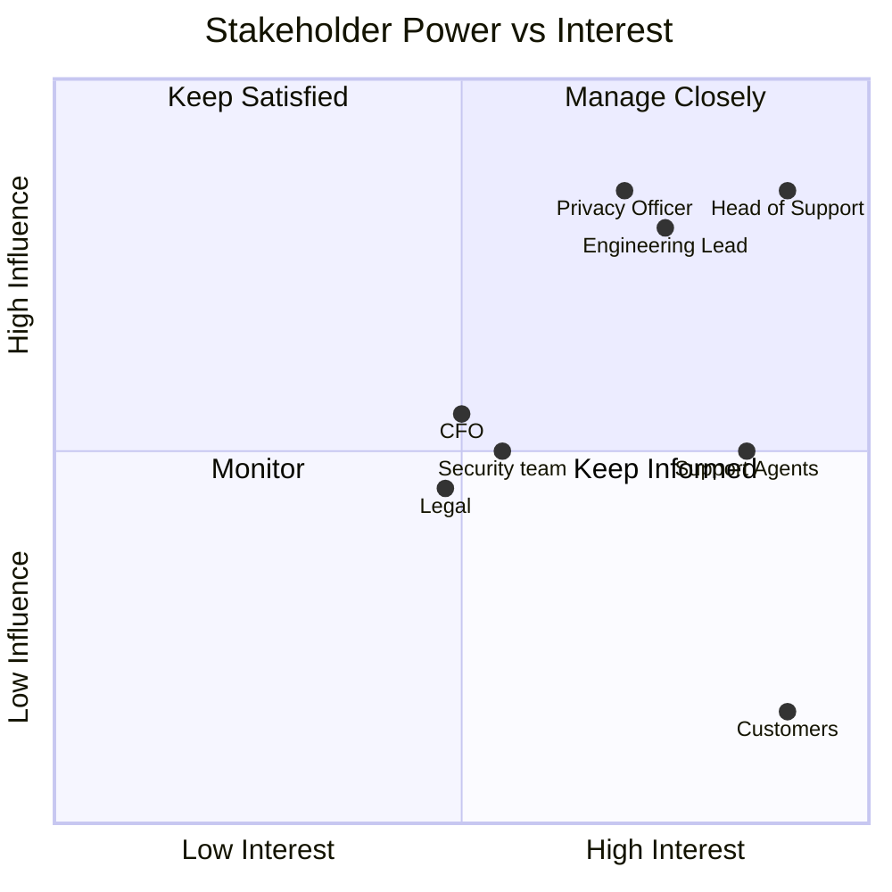

# Stakeholder Analysis — Customer Support Copilot

| Field | Value |
|---|---|
| Document ID | ARC-001-STKE-v1.0 |
| Status | Draft |
| Version | 1.0 |
| Date | 2026-09-17 |
| Author | ArcKit AI Assistant (reviewed by Harish Subash) |
| Project | 001-support-copilot |

## Context

Meridian Workspace (illustrative company) runs a 40-agent support team handling roughly 15,000 tickets/month across email and in-app chat. This document identifies who is affected by, or can affect, the introduction of an AI copilot into that workflow, and how each stakeholder is engaged.

## Stakeholder Register

| ID | Stakeholder | Role | Interest | Influence | Engagement Approach |
|---|---|---|---|---|---|
| STK-01 | Head of Customer Support | Business owner, accountable for CSAT and resolution time | High — programme succeeds or fails against their KPIs | High | Co-chairs the steering group; approves the confidence threshold and rollout gates |
| STK-02 | Support Agents | End users of the copilot inside the ticketing UI | High — directly changes daily workflow | Medium | Included in pilot-team selection; weekly feedback sessions during shadow mode and pilot |
| STK-03 | Data Privacy Officer | Accountable for DPIA sign-off and data-handling compliance | High — can block launch | High | Reviews DPIA (ARC-001-DPIA, future artifact) and the PII-redaction design before pilot |
| STK-04 | Engineering Lead | Owns build, run, and on-call for the platform | High — inherits operational risk | High | Co-author of platform design and ADRs; owns the quality-gate implementation |
| STK-05 | CFO / Finance | Funds the programme, tracks token-cost run rate | Medium — cares about ROI, not implementation detail | Medium | Reviews the business case financial case; monthly cost dashboard once live |
| STK-06 | Customers (indirect) | Recipients of AI-assisted answers | High — experience quality directly, has no direct voice in design | Low (no direct influence, high interest) | Represented via CSAT scores, complaint-rate monitoring, and the human-handoff safety net |
| STK-07 | Security team | Accountable for prompt-injection and data-exfiltration risk | Medium — one of several review gates | Medium | Reviews ADR-001 and ADR-002; sign-off required before general availability |
| STK-08 | Legal / Compliance | Reviews customer-facing AI disclosure and liability | Medium | Medium | Reviews customer-facing copy disclosing AI involvement; consulted on retention policy |

## Power/Interest Summary

## Engagement Cadence

- **Weekly** during shadow mode and pilot: agent feedback session, quality metrics review.
- **Fortnightly**: steering group (Head of Support, Engineering Lead, Privacy Officer).
- **Per release**: security and legal sign-off before any prompt, model, or retrieval-index change is promoted past shadow mode.
- **Monthly** once live: CFO cost review, CSAT trend review.
